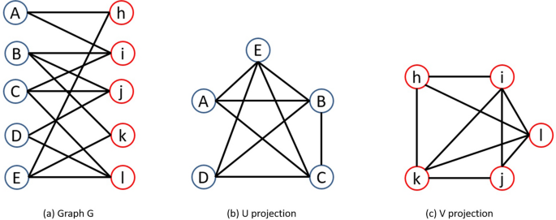

# Bipartite Graph Checker

Bipartite graph (or bigraph) is a graph whose vertices can be divided into two disjoint and independent sets U and V, that is every edge connects a vertex in U to one in V.

This algorithm check if a graph is bipartite. If its true, return the two sets. Based in:

> Theorem: The graph G is bipartite if and only if it has no odd cycles.

## Exemple of Bipartite Graph:

