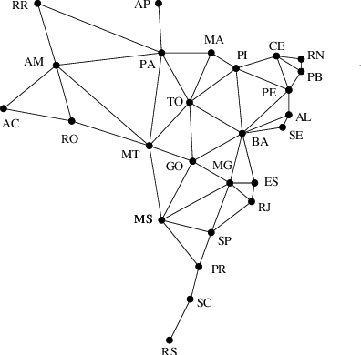

# Bron–Kerbosch algorithm

Bron–Kerbosch algorithm is an enumeration algorithm for finding all maximal cliques in an undirected graph. It lists all subsets of vertices with the two properties that each pair of vertices in one of the listed subsets is connected by an edge, and no listed subset can have any additional vertices added to it while preserving its complete connectivity.



```py
    MAXIMUM = {{AC, AM, RO}, {RO, AM, MT}, {PA, AM, MT}, {PA, TO, MA}, {TO, MA, PI}, {TO, BA, PI}, {TO, GO, MT}, {PI, CE, PE}, {CE, RN, PB}, {CE, PE, PB}, {AL, BA, PE}, {MS, MT, GO}, {MS, SP, MG}, {GO, BA, MG}, {MG, BA, ES}, {MG, RJ, SP}, {SC, RS}}

    MAXIMAL = {{AC, AM, RO}, {RO, AM, MT}, {PA, AM, MT}, {PA, TO, MA}, {TO, MA, PI}, {TO, BA, PI}, {TO, GO, MT}, {PI, CE, PE}, {CE, RN, PB}, {CE, PE, PB}, {AL, BA, PE}, {MS, MT, GO}, {MS, SP, MG}, {GO, BA, MG}, {MG, BA, ES}, {MG, RJ, SP}}
```
