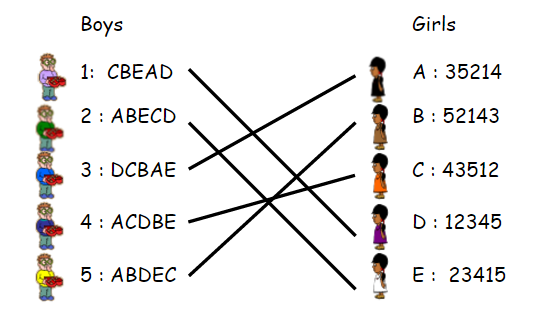

# Gale-Shapley_algorithm

Gale–Shapley algorithm is an algorithm for finding a solution to the stable matching problem, problem of finding a stable matching between two equally sized sets of elements given an ordering of preferences for each element.

I use the solving the classic stable marriage problem for apply the algorithm.

## Stable marriage problem



```
Result:

1 C
2 E
3 B
4 D
5 A

Interactions: 23

```