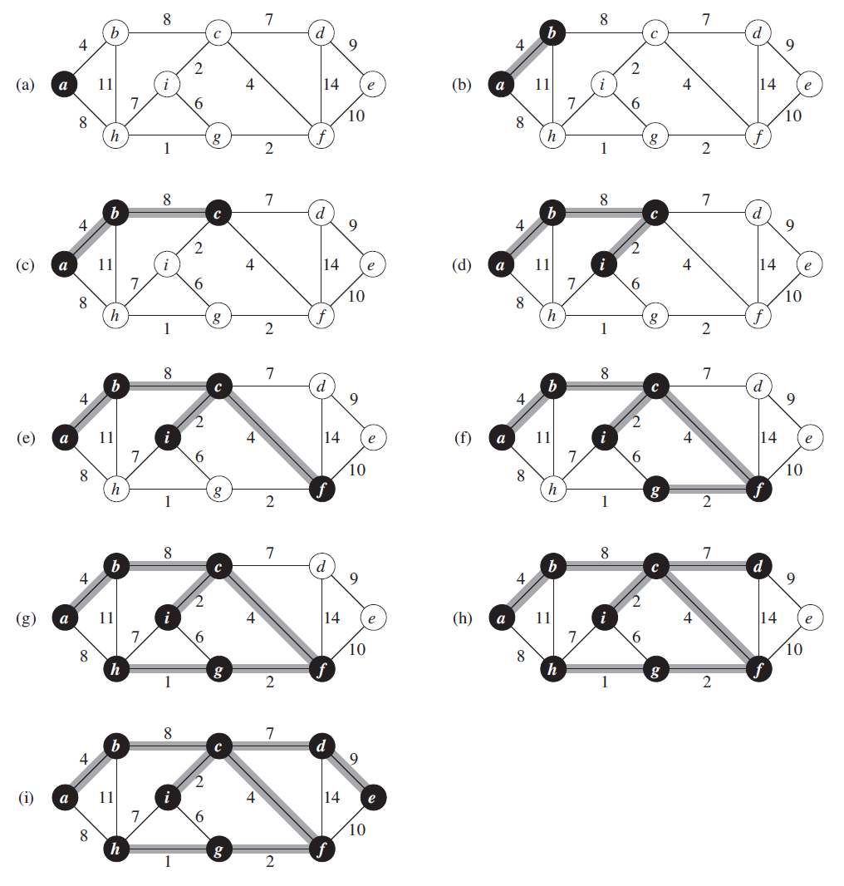

# Prim_algorithm

Prim's algorithm is a algorithm that finds a minimum spanning tree for a weighted undirected graph. Otherwise, finds all edges that connect all vertices with minimum coast.

## Steps:

