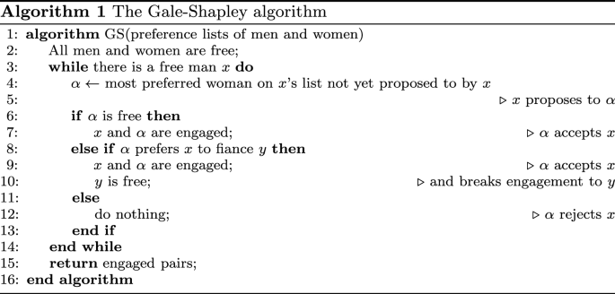

# Projeto 2 de TAG - Teoria e Aplicação de Grafos

Projeto 2 da disiciplina de Teoria e Aplicação de Grafos - TAG, Universidade de Brasília - UnB.

Desenvolvido por Oseias Romeiro Magalhães - 211036123 

## Problema:

Uma determinada unidade da federação fez um concurso e foram aprovados 100 novos professores para escolas públicas, das quais 50, se habilitaram a receber novos professores.
Cada professor pode escolher uma ordem de até 4 escolas de preferência e as escolas podem indicar as habilitações que tem preferência.

> Os dados do problema estão disponíveis em [entrada.txt](./entrada.txt).

## Solução:

Foi utilizado o algorito de Gale-Shapley com algumas modificações para adaptar-se ao problema, para encontrar encontrar o emparelhamento estável máximo.



No caso, os professores e as escolas foram instanciados com as classes [Professor.py](./Professor.py) e [Escola.py](./Escola.py), e colocados em suas respectivas listas (`professores` e `escolas` ). Assim segue-se o algoritmo de Gale-Shapley, enquanto estiver escolas sem nenhum professor, destinando um professor ou mais a cada escola baseado na lista de preferêcnias do professor e habilitações da escola.

## Run

Certifique-se que os arquivos ```entrada.txt```, ```Professor.py```, ```Escola.py``` e ```Projeto2.py``` estejam na mesma pasta.

```sh
    python3 Projeto2.py
```

